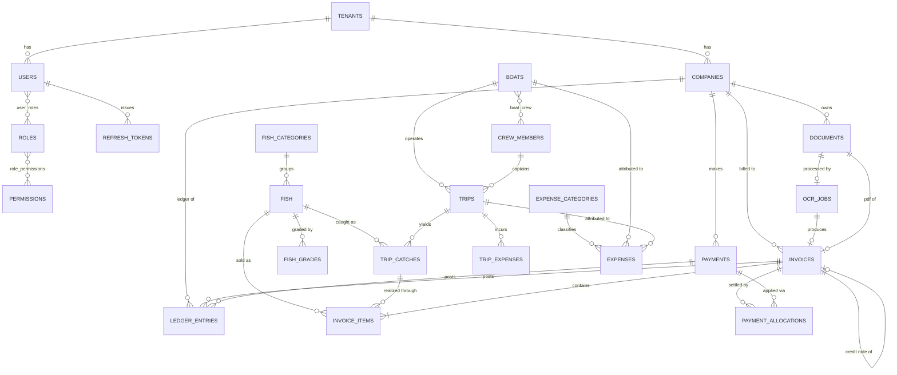

# FishERP — System Architecture & Technical Blueprint

## Context

Fish traders, wholesalers, exporters and boat owners currently run on paper: handwritten invoices, ledger books for company balances, loose slips for trip expenses, and mental arithmetic for profit. The consequences are predictable — outstanding balances are unknown or disputed, boat profitability is a guess, and there is no reliable record when a customer contests an invoice.

FishERP replaces that with a single system of record for **companies (customers), fish master data, boats, trips, invoices, payments, expenses and documents**, plus reporting and analytics on top.

**Decisions locked with the user before drafting:**

| Decision | Choice | Consequence |
|---|---|---|
| Multi-tenancy | Tenant-ready schema, ship single-tenant | `tenant_id` on every business table + Postgres RLS from day 1; no SaaS billing/onboarding in v1 |
| Offline | Online-only | Standard SSR/CSR web app; no local-first sync layer. PWA deferred |
| OCR / AI | Design now, build later | Full pipeline design + schema hooks in v1; implementation in M6/M7 |
| Scale | Unknown → design small, document triggers | Single-node Docker Compose v1, with explicit metric thresholds for each scale-up step |

This document is a blueprint, not code. It should be sufficient for a team to start Milestone 1 without further architectural debate.

---

## 1. Overall System Architecture

### 1.1 Style: Modular Monolith

**Decision: a modular monolith, not microservices.**

A single FastAPI deployable, internally partitioned into domain modules with enforced boundaries. Each module owns its tables, its service layer, and its API router. Modules talk to each other through explicit service interfaces — never by reaching into another module's repository or importing its ORM models directly.

*Trade-off.* Microservices would give independent scaling and deploy isolation. For a team of 1–5 building an ERP where nearly every operation is a multi-entity transaction (an invoice touches company, fish, stock, ledger, and documents), distributed transactions would dominate the engineering budget and buy nothing. The modular monolith keeps ACID transactions free while preserving the *seams* — if `reporting` or `ocr` later needs to split out, the boundary already exists.

*Risk.* Modular monoliths rot into big-ball-of-mud without enforcement. **Mitigation:** an import-linter contract in CI that fails the build when a module imports another module's internals (see §32).

### 1.2 Runtime Topology

```
                          ┌─────────────┐
                          │   Browser   │
                          └──────┬──────┘
                                 │ HTTPS
                    ┌────────────▼────────────┐
                    │  Caddy / Nginx (TLS,    │
                    │  gzip, static, rate LB) │
                    └───┬─────────────────┬───┘
                        │                 │
              ┌─────────▼──────┐   ┌──────▼─────────┐
              │  Next.js 15    │   │  FastAPI       │
              │  (SSR + RSC)   │──▶│  /api/v1       │
              │  BFF proxy     │   │  (uvicorn x N) │
              └────────────────┘   └───┬───┬────┬───┘
                                       │   │    │
              ┌────────────────────────┘   │    └──────────────┐
              │                            │                   │
      ┌───────▼────────┐          ┌────────▼──────┐   ┌────────▼───────┐
      │  PostgreSQL 16 │          │  Redis 7      │   │  S3 / R2       │
      │  (RLS, FTS,    │          │  cache +      │   │  documents,    │
      │   pgcrypto)    │          │  broker +     │   │  invoices,     │
      │                │          │  rate limit   │   │  receipts      │
      └───────▲────────┘          └────────▲──────┘   └────────▲───────┘
              │                            │                   │
              │                   ┌────────┴──────────┐        │
              └───────────────────┤  Celery Workers   ├────────┘
                                  │  default | pdf |  │
                                  │  ocr | reports    │
                                  │  + Celery Beat    │
                                  └───────────────────┘
```

**Why Next.js proxies the API (BFF pattern).** The browser never holds a long-lived refresh token in JS-accessible storage. Next.js route handlers hold the refresh token in an `HttpOnly` cookie and attach access tokens server-side. This kills the entire class of XSS token-exfiltration attacks. See §8.

### 1.3 Layering (Clean Architecture)

Dependencies point inward only. Domain knows nothing about FastAPI, SQLAlchemy, or Redis.

```
   ┌──────────────────────────────────────────────────┐
   │  API Layer      routers, request/response DTOs,  │
   │                 dependency wiring, auth guards   │
   ├──────────────────────────────────────────────────┤
   │  Application    services / use-cases, unit of    │
   │  Layer          work, orchestration, permissions │
   ├──────────────────────────────────────────────────┤
   │  Domain Layer   entities, value objects, domain  │
   │                 services, invariants, events     │
   ├──────────────────────────────────────────────────┤
   │  Infra Layer    SQLAlchemy models + repositories,│
   │                 S3 client, Redis, mail, OCR      │
   └──────────────────────────────────────────────────┘
```

**Pragmatic concession:** we do *not* maintain separate domain entities and ORM models for simple CRUD modules (fish master, company). That duplication is pure tax. We *do* separate them for the modules with real invariants — `invoicing`, `payments`, `trips` — where a `Money` value object and an `Invoice` aggregate that refuses to mutate after issue earn their keep.

*This is the most important pragmatic decision in the document.* Full DDD everywhere would triple the MVP code volume for CRUD screens that have no business rules.

---

## 2. Folder Structure

```
fisherp/
├── docker-compose.yml
├── docker-compose.prod.yml
├── .github/workflows/            # ci.yml, cd.yml, security.yml
│
├── backend/
│   ├── pyproject.toml            # uv / poetry, ruff, mypy config
│   ├── alembic/versions/
│   ├── app/
│   │   ├── main.py               # app factory, middleware, router mount
│   │   ├── core/                 # cross-cutting, no business logic
│   │   │   ├── config.py         # pydantic-settings
│   │   │   ├── security.py       # JWT encode/decode, password hashing
│   │   │   ├── permissions.py    # Permission enum, role→perm matrix
│   │   │   ├── db.py             # engine, session, RLS session hook
│   │   │   ├── tenancy.py        # tenant context var
│   │   │   ├── errors.py         # exception hierarchy + handlers
│   │   │   ├── logging.py        # structlog config
│   │   │   ├── pagination.py     # cursor pagination helpers
│   │   │   └── money.py          # Money value object (Decimal)
│   │   │
│   │   ├── modules/
│   │   │   ├── auth/
│   │   │   ├── companies/
│   │   │   ├── fish/
│   │   │   ├── boats/
│   │   │   ├── trips/
│   │   │   ├── invoicing/
│   │   │   ├── payments/
│   │   │   ├── expenses/
│   │   │   ├── documents/
│   │   │   ├── reporting/
│   │   │   ├── analytics/
│   │   │   ├── ocr/
│   │   │   ├── ai/
│   │   │   ├── notifications/
│   │   │   └── audit/
│   │   │
│   │   ├── api/v1/router.py      # aggregates module routers
│   │   ├── workers/              # celery_app.py, tasks, beat schedule
│   │   └── shared/               # events bus, outbox, numbering, storage
│   └── tests/{unit,integration,e2e,factories}/
│
└── frontend/
    ├── src/
    │   ├── app/
    │   │   ├── (auth)/login/
    │   │   ├── (dashboard)/
    │   │   │   ├── companies/ fish/ boats/ trips/
    │   │   │   ├── invoices/ payments/ expenses/
    │   │   │   ├── reports/ documents/ settings/
    │   │   │   └── layout.tsx
    │   │   └── api/              # BFF route handlers (token custody)
    │   ├── components/{ui,forms,tables,charts,layout}/
    │   ├── features/             # mirrors backend modules
    │   │   └── invoicing/{api,hooks,components,schemas,types}.ts
    │   ├── lib/{api-client,auth,permissions,format,utils}.ts
    │   └── stores/               # zustand: ui, filters, invoice-draft
    └── tests/{unit,e2e}/
```

**Every backend module has an identical internal shape** — this is what makes the codebase navigable at 50k lines:

```
modules/invoicing/
├── __init__.py
├── router.py         # FastAPI routes ONLY — no business logic
├── schemas.py        # Pydantic v2 request/response DTOs
├── models.py         # SQLAlchemy ORM
├── repository.py     # all queries; returns models/dicts, never DTOs
├── service.py        # use-cases, orchestration, transactions
├── domain.py         # entities, value objects, invariants (rich modules)
├── events.py         # domain events emitted
├── tasks.py          # Celery tasks owned by this module
├── exceptions.py
└── constants.py
```

**Rule: `router.py` may only call `service.py`. `service.py` may only call its own `repository.py` plus other modules' `service.py`.** Enforced by import-linter.

---

## 3. Backend Architecture

### 3.1 Request Lifecycle

```
Request
  → RequestIDMiddleware        (generate/propagate X-Request-ID)
  → StructuredLoggingMiddleware
  → CORSMiddleware
  → RateLimitMiddleware        (Redis token bucket, §24)
  → AuthDependency             (decode JWT → CurrentUser)
  → TenantDependency           (set tenant ctx + Postgres SET LOCAL)
  → PermissionDependency       (require_permission("invoice:create"))
  → Router handler
  → Service (opens Unit of Work / transaction)
      → Domain (validate invariants)
      → Repository (SQL)
      → emit domain events → transactional outbox
  → commit → publish outbox to Celery
  → Response DTO
```

### 3.2 Repository Pattern

Repositories are the only place raw SQLAlchemy queries live. This keeps services testable against a fake repo and stops N+1 queries leaking into business logic.

```
InvoiceRepository
  get_by_id(id) -> Invoice | None
  get_by_number(number) -> Invoice | None
  list(filters: InvoiceFilter, cursor, limit) -> Page[Invoice]
  add(invoice) -> None
  outstanding_by_company(company_id) -> Money
  aging_buckets(as_of: date) -> list[AgingRow]
```

**Do not build a generic `BaseRepository[T]` with 30 abstract methods.** It always leaks and forces awkward query shapes. A small shared mixin for `get_by_id` / `soft_delete` / `list_paginated` is enough; write explicit methods for everything else.

### 3.3 Unit of Work

One database transaction per request, owned by the service layer, not by the repository. A service that creates an invoice, decrements stock, writes a ledger entry and queues a PDF job either does all of it or none of it.

```python
# shape, not implementation
async with uow:
    invoice = await uow.invoices.add(...)
    await uow.ledger.post(...)
    uow.emit(InvoiceIssued(invoice.id))
    await uow.commit()   # outbox flushed here, tasks dispatched after commit
```

**Critical:** Celery tasks are dispatched *after* commit, never inside the transaction. Otherwise a worker can pick up a job for a row that has not been committed (or gets rolled back) — a classic and maddening race. The transactional outbox (§19) is what guarantees this.

### 3.4 Async Strategy

FastAPI with `async def` handlers and SQLAlchemy 2.0 async engine (`asyncpg`). Long or CPU-bound work (PDF rendering, OCR, large report aggregation, Excel export) goes to Celery — never inline. Any handler expected to exceed ~500ms becomes a job + polling/notification.

---

## 4. Frontend Architecture

### 4.1 Rendering Strategy

| Screen type | Strategy | Why |
|---|---|---|
| Login, public | Static / client | No data deps |
| List pages (invoices, companies) | **Server Component** + server-side fetch | Fast first paint, no loading spinner cascade, filters in URL |
| Dashboards / charts | Server shell + client chart islands | Chart libs are client-only |
| Forms (invoice create/edit) | **Client Component** | Heavy interactivity, line-item arrays, live totals |
| Reports | Server Component + streaming `Suspense` | Slow queries stream in progressively |

Default to Server Components. Add `"use client"` only at the leaf that genuinely needs interactivity — this is the single biggest lever on bundle size in Next.js 15.

### 4.2 Data Layer

- **TanStack Query** for all client-side server state: caching, invalidation, optimistic updates, retry.
- **Server Actions** for mutations that are simple form posts (create company, toggle fish active). Fewer moving parts than an API route + client fetch.
- **Direct API calls via TanStack Query** for anything needing optimistic UI, progress, or complex error handling (invoice creation, file upload).

*Trade-off:* mixing Server Actions and TanStack Query is two mutation paths. The rule that keeps it sane: **Server Actions for CRUD forms, TanStack Query when the UI must react to intermediate state.**

### 4.3 Forms

`react-hook-form` + `zod` resolver. **Zod schemas are generated from the backend OpenAPI spec** (`openapi-zod-client` or `orval` in CI) so frontend validation can never drift from Pydantic. This is worth setting up in Milestone 1 — retrofitting it is painful and drift bugs are silent.

### 4.4 The Invoice Editor

The most complex screen in the app; budget for it accordingly.

- Dynamic line items via `useFieldArray`
- Fish autocomplete with `cmdk`, server-side search, debounced
- **All monetary math in `decimal.js` — never JS `number`.** `0.1 + 0.2 !== 0.3` and an ERP cannot ship that.
- Totals recomputed client-side for instant feedback, but **the server always recomputes and its number wins.** Client math is a UX affordance, never the source of truth.
- Autosave draft to `localStorage` keyed by draft id — recovers from an accidental tab close mid-invoice.
- Keyboard-first: Tab through line items, Enter adds a row. Users entering 40 invoices a day live on the keyboard; making them reach for a mouse is the difference between adoption and rejection.

---

## 5. Database Schema

### 5.1 Conventions

- `snake_case`; tables plural.
- **PK: `UUID v7`** (`id uuid primary key`). v7 is time-ordered, so it indexes almost as well as bigint while staying globally unique and non-enumerable in URLs. (v4's randomness causes B-tree page splits and index bloat at volume.)
- **Money: `NUMERIC(14,2)`**. **Weight: `NUMERIC(12,3)`** (grams precision). **Rate: `NUMERIC(12,4)`**. Never `float`/`double` for anything financial.
- Every money column pairs with a `currency CHAR(3)` at the document level.
- Timestamps: `TIMESTAMPTZ`, always UTC. Business dates that are calendar-day concepts (invoice date, trip date) are `DATE`.
- Every business table carries: `id, tenant_id, created_at, updated_at, created_by, updated_by, deleted_at`.
- Enums as Postgres native `ENUM` where the set is genuinely closed (`payment_method`), as lookup tables where users may extend it (`expense_category`).

### 5.2 Core Tables

**Tenancy & Identity**

```
tenants(id, name, slug UNIQUE, status, plan, settings JSONB,
        fiscal_year_start_month, base_currency, created_at)

users(id, tenant_id, email, password_hash, full_name, phone,
      status, is_superuser, last_login_at, failed_login_count,
      locked_until, password_changed_at, created_at, deleted_at)
      UNIQUE(tenant_id, lower(email)) WHERE deleted_at IS NULL

roles(id, tenant_id, name, description, is_system)
permissions(id, code UNIQUE, resource, action, description)   -- global
role_permissions(role_id, permission_id)  PK(role_id, permission_id)
user_roles(user_id, role_id, assigned_at, assigned_by)  PK(user_id, role_id)

refresh_tokens(id, user_id, token_hash, family_id, expires_at,
               revoked_at, replaced_by, user_agent, ip)
password_reset_tokens(id, user_id, token_hash, expires_at, used_at)
```

`refresh_tokens` stores a **SHA-256 hash**, never the token. `family_id` enables reuse detection (§8).

**Master Data**

```
companies(id, tenant_id, code UNIQUE(tenant_id,code), name, legal_name,
          gstin, pan, address_line1, line2, city, state, state_code,
          pincode, country, phone, alt_phone, email, contact_person,
          company_type,            -- customer | supplier | both
          credit_limit NUMERIC(14,2), credit_days INT,
          opening_balance NUMERIC(14,2), opening_balance_date DATE,
          status, notes, ...audit)

fish(id, tenant_id, code, name, local_name, scientific_name,
     category_id, default_unit,   -- KG | BOX | PIECE | TON
     hsn_code, default_tax_rate NUMERIC(5,2),
     is_active, ...audit)
     UNIQUE(tenant_id, lower(name)) WHERE deleted_at IS NULL

fish_categories(id, tenant_id, name, parent_id, sort_order)
fish_grades(id, tenant_id, fish_id NULL, name, sort_order)
   -- fish_id NULL = grade usable across all fish
```

**Boats & Trips**

```
boats(id, tenant_id, name, registration_number UNIQUE(tenant_id,·),
      boat_type, capacity_tons NUMERIC(10,2), engine_details,
      owner_name, owner_company_id FK companies NULL,
      ownership_type,             -- owned | leased | partner
      purchase_date, status, ...audit)

crew_members(id, tenant_id, full_name, role,   -- captain | engineer | crew
             phone, id_proof_type, id_proof_number,
             daily_wage NUMERIC(12,2), share_percentage NUMERIC(5,2),
             status, ...audit)

boat_crew(id, boat_id, crew_member_id, role, from_date, to_date, is_active)

trips(id, tenant_id, trip_number UNIQUE(tenant_id,·), boat_id,
      captain_id FK crew_members,
      departure_at TIMESTAMPTZ, return_at TIMESTAMPTZ NULL,
      departure_port, return_port, fishing_zone,
      status,                     -- planned|at_sea|returned|settled|cancelled
      total_expense NUMERIC(14,2),   -- denormalized, see §16
      total_revenue NUMERIC(14,2),
      gross_profit  NUMERIC(14,2),
      crew_share    NUMERIC(14,2),
      net_profit    NUMERIC(14,2),
      calculated_at TIMESTAMPTZ,
      notes, ...audit)

trip_expenses(id, tenant_id, trip_id, category,  -- fuel|diesel|ice|food|labor|repair|misc
              description, quantity NUMERIC(12,3), unit,
              unit_price NUMERIC(12,4), amount NUMERIC(14,2),
              paid_to, payment_method, expense_date, receipt_document_id,
              ...audit)

trip_catches(id, tenant_id, trip_id, fish_id, grade_id NULL,
             weight_kg NUMERIC(12,3), boxes INT,
             estimated_rate NUMERIC(12,4),
             estimated_value NUMERIC(14,2),
             sold_weight_kg NUMERIC(12,3) DEFAULT 0,   -- rolled up from links
             realized_value NUMERIC(14,2) DEFAULT 0,
             wastage_kg NUMERIC(12,3) DEFAULT 0,
             ...audit)
```

**Invoicing**

```
invoices(id, tenant_id, invoice_number UNIQUE(tenant_id,·),
         invoice_type,            -- sales | credit_note | proforma
         company_id, invoice_date DATE, due_date DATE,
         status,   -- draft|issued|partially_paid|paid|overdue|cancelled
         currency CHAR(3),
         subtotal          NUMERIC(14,2),
         discount_type,            -- none | percent | amount
         discount_value    NUMERIC(14,4),
         discount_amount   NUMERIC(14,2),
         taxable_amount    NUMERIC(14,2),
         cgst_amount / sgst_amount / igst_amount NUMERIC(14,2),
         tax_amount        NUMERIC(14,2),
         transport_charge  NUMERIC(14,2),
         other_charges     NUMERIC(14,2),
         round_off         NUMERIC(6,2),
         total_amount      NUMERIC(14,2),
         paid_amount       NUMERIC(14,2) DEFAULT 0,
         balance_amount    NUMERIC(14,2),     -- generated: total - paid
         place_of_supply, reference_number, notes, terms,
         pdf_document_id, source_document_id,   -- OCR original
         issued_at, cancelled_at, cancellation_reason,
         parent_invoice_id,                     -- credit note → original
         ...audit)

invoice_items(id, tenant_id, invoice_id, line_number,
              fish_id, grade_id NULL, description,
              trip_catch_id NULL,        -- ← links revenue to a trip (§16)
              quantity NUMERIC(12,3), unit,
              boxes INT NULL, weight_per_box NUMERIC(10,3) NULL,
              rate NUMERIC(12,4),
              discount_percent NUMERIC(5,2), discount_amount NUMERIC(14,2),
              taxable_amount NUMERIC(14,2),
              tax_rate NUMERIC(5,2), tax_amount NUMERIC(14,2),
              line_total NUMERIC(14,2), ...audit)

invoice_sequences(tenant_id, prefix, fiscal_year, last_number)
   PK(tenant_id, prefix, fiscal_year)
```

**Payments — the part most systems get wrong**

```
payments(id, tenant_id, payment_number UNIQUE(tenant_id,·),
         company_id, payment_date DATE,
         direction,               -- received | paid
         method,                  -- cash|upi|cheque|bank_transfer|card|adjustment
         amount NUMERIC(14,2),
         allocated_amount NUMERIC(14,2) DEFAULT 0,
         unallocated_amount NUMERIC(14,2),    -- generated
         reference_number, bank_name, cheque_date,
         cheque_status,           -- pending|cleared|bounced
         cleared_at, receipt_document_id, notes,
         status,                  -- pending|completed|bounced|cancelled
         ...audit)

payment_allocations(id, tenant_id, payment_id, invoice_id,
                    amount NUMERIC(14,2), allocated_at, allocated_by)
   UNIQUE(payment_id, invoice_id)
```

**`payment_allocations` is non-negotiable.** In real fish trading a customer hands over ₹2,00,000 against six invoices, or pays on account with nothing allocated yet. A `payments.invoice_id` foreign key cannot represent that and forces users to invent fake split payments. The many-to-many allocation table is the correct model and costs almost nothing to build up front — but retrofitting it after go-live means migrating live financial data.

**Ledger (append-only)**

```
ledger_entries(id, tenant_id, company_id, entry_date DATE,
               entry_type,        -- invoice|payment|credit_note|opening|adjustment
               source_type, source_id,     -- polymorphic ref
               debit NUMERIC(14,2) DEFAULT 0,
               credit NUMERIC(14,2) DEFAULT 0,
               narration, created_at, created_by)
   -- NO updated_at, NO deleted_at. Corrections are reversing entries.
```

**Expenses, Documents, Audit**

```
expenses(id, tenant_id, expense_number, category_id, expense_date DATE,
         scope,        -- office | boat | trip | general
         boat_id NULL, trip_id NULL,
         amount, tax_amount, total_amount,
         paid_to, payment_method, reference_number,
         document_id, description, is_recurring,
         recurring_config JSONB, ...audit)

expense_categories(id, tenant_id, name, parent_id, code, is_active)

documents(id, tenant_id, storage_key UNIQUE, original_filename,
          mime_type, size_bytes, checksum_sha256,
          document_type,   -- invoice|receipt|gst|contract|photo|other
          entity_type, entity_id,        -- polymorphic attach
          company_id NULL, uploaded_by, upload_status,
          thumbnail_key, page_count,
          extracted_text TEXT,           -- OCR text for search
          search_vector TSVECTOR,
          metadata JSONB, ...audit)

audit_logs(id, tenant_id, user_id, action, entity_type, entity_id,
           changes JSONB,   -- {field: {old, new}}
           ip_address INET, user_agent, request_id,
           created_at)      -- append-only, monthly partitions
```

**OCR & Notifications**

```
ocr_jobs(id, tenant_id, document_id, status, provider, provider_job_id,
         raw_response JSONB, extracted_data JSONB, confidence_scores JSONB,
         overall_confidence NUMERIC(5,4),
         reviewed_by, reviewed_at, review_action,   -- accepted|corrected|rejected
         corrected_data JSONB, created_invoice_id,
         error_message, retry_count, ...audit)

notifications(id, tenant_id, user_id, type, title, body,
              entity_type, entity_id, channel, priority,
              read_at, sent_at, status, created_at)

outbox_events(id, tenant_id, event_type, aggregate_type, aggregate_id,
              payload JSONB, created_at, processed_at, retry_count, error)
```

### 5.3 Denormalization Policy

Company balance and trip profit are **derived** values. They live in two places:

1. **Source of truth:** always computable by aggregating `ledger_entries` / `trip_expenses` + `invoice_items`.
2. **Denormalized cache:** `companies.outstanding_amount`, `trips.net_profit`, maintained in the same transaction as the source change.

A nightly Celery reconciliation job recomputes from source and alerts on any drift. **Never present a stored aggregate you cannot re-derive on demand** — when a customer disputes their balance, "the number in the column" is not an answer; the ledger is.

---

## 6. ER Diagram



The relationship worth staring at is **`TRIP_CATCHES ||--o{ INVOICE_ITEMS`**. That optional link is what makes true boat profitability possible rather than estimated. See §16.

---

## 7. API Design

### 7.1 Conventions

- Base path `/api/v1`. Resource-plural nouns. `kebab-case` in paths, `snake_case` in JSON bodies.
- Standard verbs; **state transitions are sub-resource POSTs, not PATCHes**: `POST /invoices/{id}/issue`, `POST /invoices/{id}/cancel`, `POST /trips/{id}/close`. A state machine transition is an *action* with its own preconditions and permissions — modelling it as a field write loses all of that.
- Cursor pagination everywhere (`?cursor=...&limit=50`). Offset pagination degrades badly past a few thousand rows and produces duplicates when rows are inserted mid-scroll.
- Filtering: `?status=issued&company_id=...&date_from=...&date_to=...&q=...`
- Sorting: `?sort=-invoice_date,invoice_number`
- Sparse fields on heavy endpoints: `?include=items,payments`

### 7.2 Envelope

Lists:
```json
{ "data": [...],
  "meta": { "next_cursor": "…", "has_more": true, "total_count": 1284 },
  "request_id": "01J…" }
```
Single resources return the object unwrapped. Errors always use §21's shape.

### 7.3 Representative Endpoints

```
POST   /api/v1/auth/login                 → access + refresh (cookie)
POST   /api/v1/auth/refresh
POST   /api/v1/auth/logout
POST   /api/v1/auth/forgot-password
POST   /api/v1/auth/reset-password
GET    /api/v1/auth/me                    → user + roles + permissions

GET    /api/v1/companies?q=&status=&cursor=
POST   /api/v1/companies
GET    /api/v1/companies/{id}
GET    /api/v1/companies/{id}/ledger?from=&to=
GET    /api/v1/companies/{id}/statement?format=pdf
GET    /api/v1/companies/{id}/outstanding

GET    /api/v1/fish?category_id=&is_active=
POST   /api/v1/fish/bulk-import

GET    /api/v1/boats/{id}/profitability?from=&to=
POST   /api/v1/trips
POST   /api/v1/trips/{id}/expenses
POST   /api/v1/trips/{id}/catches
POST   /api/v1/trips/{id}/close          → freezes trip, computes P&L
GET    /api/v1/trips/{id}/profit-breakdown

POST   /api/v1/invoices                  → status=draft
PUT    /api/v1/invoices/{id}             → 409 unless draft
POST   /api/v1/invoices/{id}/issue       → assigns number, posts ledger
POST   /api/v1/invoices/{id}/cancel
POST   /api/v1/invoices/{id}/credit-note
GET    /api/v1/invoices/{id}/pdf         → 302 to presigned URL
POST   /api/v1/invoices/{id}/send

POST   /api/v1/payments                  → optional allocations[]
POST   /api/v1/payments/{id}/allocate
POST   /api/v1/payments/{id}/bounce
GET    /api/v1/payments/unallocated?company_id=

POST   /api/v1/documents/presign         → direct-to-S3 upload URL
POST   /api/v1/documents/{id}/confirm
GET    /api/v1/documents?q=&entity_type=&entity_id=

POST   /api/v1/ocr/jobs                  → from document_id
GET    /api/v1/ocr/jobs/{id}
POST   /api/v1/ocr/jobs/{id}/review      → accept | correct | reject

GET    /api/v1/reports/sales-summary?group_by=day|month&from=&to=
GET    /api/v1/reports/outstanding?aging=true
GET    /api/v1/reports/top-customers?limit=10
POST   /api/v1/reports/export            → 202 + job_id
GET    /api/v1/jobs/{id}                 → generic async job status
```

### 7.4 Idempotency

`POST /invoices`, `POST /payments` and all `/issue` actions accept an `Idempotency-Key` header. The key + response is cached in Redis for 24h. **This is mandatory, not optional** — a double-tap on "Save Payment" over flaky harbour mobile data must not create two ₹2,00,000 receipts.

---

## 8. Authentication Flow

### 8.1 Token Design

| Token | Lifetime | Storage | Contents |
|---|---|---|---|
| Access (JWT) | 15 min | Memory (Next.js server) | `sub, tenant_id, roles[], perms[], jti, exp, iat` |
| Refresh (opaque) | 7 days, sliding | `HttpOnly; Secure; SameSite=Strict` cookie | random 256-bit, SHA-256 hashed in DB |

Access tokens are **stateless and short-lived**; refresh tokens are **stateful and revocable**. That combination gives fast authorization checks with real logout semantics.

*Trade-off:* embedding permissions in the JWT avoids a DB/Redis lookup per request, but a permission revocation takes up to 15 minutes to bite. Mitigation: a Redis `user:{id}:perm_version` counter checked only on sensitive actions (payments, user management, settings), forcing an immediate re-issue when it changes. This buys correctness where it matters without paying the lookup cost on every read.

### 8.2 Login

```
Browser → POST /api/auth/login (Next.js route handler)
   → FastAPI POST /api/v1/auth/login {email, password}
       - rate limit: 5 attempts / 15 min per (email, IP)
       - argon2id verify   ← not bcrypt: memory-hard, better GPU resistance
       - constant-time dummy hash on unknown email (no user enumeration)
       - on success: reset failed_login_count, issue tokens, audit log
       - on 5th failure: lock account 15 min, notify user by email
   ← {access_token, refresh_token, user}
Next.js sets HttpOnly refresh cookie, keeps access token server-side,
returns only the user profile to the browser.
```

### 8.3 Refresh Rotation with Reuse Detection

Every refresh **rotates**: the old token is revoked and a new one issued in the same `family_id`.

**If a token that was already revoked is presented, the entire family is revoked immediately and the user is force-logged-out on all devices.** That is the signature of a stolen refresh token being replayed, and it is the main reason to store refresh tokens server-side at all.

### 8.4 Password Reset

Single-use token, SHA-256 hashed at rest, 30-minute expiry. **The response is identical whether or not the email exists** — otherwise the endpoint becomes a user-enumeration oracle. On successful reset: revoke every refresh token family for that user, write an audit entry, and send a confirmation email.

---

## 9. Authorization Strategy

### 9.1 Model: RBAC with Permission Codes

Roles never appear in business logic. Code checks *permissions*; roles are a bundling convenience that admins can edit.

Permission format `resource:action` — `invoice:create`, `invoice:issue`, `payment:delete`, `report:view_profit`, `company:view_credit`.

### 9.2 Role → Permission Matrix

| Permission group | Admin | Manager | Accountant | Sales | Boat Mgr | Staff |
|---|:-:|:-:|:-:|:-:|:-:|:-:|
| company: view / create / edit | ✓✓✓ | ✓✓✓ | ✓✓· | ✓✓· | ··· | ✓·· |
| company: delete, credit limit | ✓ | · | · | · | · | · |
| fish: view / manage | ✓✓ | ✓✓ | ✓· | ✓· | ✓· | ✓· |
| invoice: view / create / edit | ✓✓✓ | ✓✓✓ | ✓✓✓ | ✓✓✓ | ··· | ✓·· |
| invoice: issue | ✓ | ✓ | ✓ | ✓ | · | · |
| invoice: cancel / credit-note | ✓ | ✓ | ✓ | · | · | · |
| payment: view / record | ✓✓ | ✓✓ | ✓✓ | ✓· | ·· | ·· |
| payment: delete / bounce | ✓ | · | ✓ | · | · | · |
| boat / trip: view | ✓ | ✓ | ✓ | · | ✓ | · |
| trip: create / edit / close | ✓✓✓ | ✓✓✓ | ··· | ··· | ✓✓✓ | ··· |
| expense: view / create | ✓✓ | ✓✓ | ✓✓ | ·· | ✓✓ | ·· |
| expense: approve | ✓ | ✓ | · | · | · | · |
| report: sales / outstanding | ✓✓ | ✓✓ | ✓✓ | ✓· | ·· | ·· |
| report: profit | ✓ | ✓ | ✓ | · | · | · |
| boat report: profit | ✓ | ✓ | ✓ | · | ✓ | · |
| user / role management | ✓ | · | · | · | · | · |
| audit log: view | ✓ | ✓ | · | · | · | · |
| settings: manage | ✓ | · | · | · | · | · |

Note **Boat Manager sees boat profit but not sales/customer data**, and **Sales sees customers and invoices but not profit margins**. Segregating margin visibility from sales staff is a genuine requirement in trading businesses.

### 9.3 Enforcement Layers

1. **Route level** — `Depends(require_permission("invoice:issue"))`. Coarse gate.
2. **Service level** — object-scoped rules (a Boat Manager may only close trips for boats they are assigned to). Route-level checks cannot express this.
3. **Row level** — Postgres RLS for `tenant_id`. Defence in depth: even a SQL-injection or a forgotten `WHERE` clause cannot cross tenants.
4. **UI level** — hide/disable controls the user lacks permission for. **Cosmetic only. Never the security boundary.**

---

## 10. State Management

Deliberately minimal — most "state" is server state, and treating it as client state is the classic React ERP mistake.

| State | Tool | Notes |
|---|---|---|
| Server data | **TanStack Query** | Cache keys mirror API resources; invalidate on mutation |
| URL/filter state | **`nuqs`** (URL search params) | Filters live in the URL → shareable, back-button-correct, bookmarkable. Non-negotiable for list screens users share |
| Form state | **react-hook-form** | Local to the form |
| Ephemeral UI (modals, sidebar) | **Zustand** | Tiny stores |
| Auth/session | **Server-side (Next.js)** + React Context for the user profile | No tokens in client state |
| Invoice draft | **Zustand + localStorage persist** | Crash/tab-close recovery |

**No Redux.** With TanStack Query owning server state, a global client store would hold almost nothing but modal booleans.

---

## 11. File Storage Strategy

S3-compatible object storage (**Cloudflare R2 recommended** — zero egress fees, and an ERP repeatedly serving invoice PDFs and receipt photos is egress-heavy; on AWS S3 this becomes a real monthly line item).

**Buckets**
- `fisherp-documents` — private. All user uploads and generated PDFs.
- `fisherp-public` — company logos, brand assets. CDN-fronted.
- `fisherp-backups` — DB dumps. Object-lock / immutable, separate credentials.

**Access is exclusively via presigned URLs (5–15 min TTL).** The API never proxies file bytes; that would pin an ASGI worker for the duration of every download.

**Lifecycle**
- Originals: Standard 90 days → Infrequent Access.
- Generated PDFs: regenerable, so IA after 30 days.
- Backups: 7 daily, 4 weekly, 12 monthly, then Glacier/archive.
- Orphaned uploads (`upload_status='pending'` > 24h): nightly sweep deletes.

**Server-side encryption at rest (SSE-S3 / R2 default), versioning on for `documents`** so a mis-click cannot destroy a scanned GST certificate.

---

## 12. Image Upload Flow

**Direct browser → S3.** Bytes never transit FastAPI.

```
1. Browser: POST /api/v1/documents/presign
            {filename, mime_type, size_bytes, document_type,
             entity_type, entity_id}

2. Server:  validate mime allowlist (jpeg,png,webp,heic,pdf)
            validate size (images ≤10MB, PDFs ≤25MB)
            generate storage_key (§39)
            INSERT documents(upload_status='pending')
            return {document_id, upload_url, fields, expires_at}

3. Browser: PUT directly to S3 with progress bar
            (client-side downscale >2000px via canvas before upload —
             a 12MP phone photo of a paper invoice is 8MB for no benefit)

4. Browser: POST /api/v1/documents/{id}/confirm {checksum_sha256}

5. Server:  HEAD object → verify existence, size, content-type
            verify checksum matches
            upload_status='completed'
            enqueue post_process_document task

6. Worker:  - sniff real MIME from magic bytes (never trust the header)
            - ClamAV scan → quarantine on hit
            - strip EXIF (GPS data on staff phone photos is a privacy leak)
            - generate 400px thumbnail + 1200px preview
            - PDFs: page count, render page-1 thumbnail
            - if document_type='invoice' → enqueue OCR job
            - update search_vector
```

**Why `confirm` exists:** without it, a browser that dies mid-PUT leaves a `pending` row with no object, and a malicious client could claim an upload it never made. The HEAD + checksum verification closes both.

---

## 13. Invoice Generation Flow

### 13.1 Numbering

Format: `INV/2025-26/00042` — `{prefix}/{fiscal_year}/{zero-padded sequence}`.

**Numbers are assigned at `issue`, never at draft creation.** Otherwise abandoned drafts punch permanent holes in the sequence — which is a compliance problem for GST audit in India, where gaps must be explainable.

Allocation uses `SELECT … FOR UPDATE` on the `invoice_sequences` row inside the issuing transaction. Postgres sequences are *not* usable here: they are non-transactional and gap on rollback, exactly what we must avoid.

*Contention note:* the row lock serializes concurrent issues within one tenant/prefix/year. At ERP volumes (hundreds/day) this is irrelevant; the correctness guarantee is worth far more than the throughput.

### 13.2 Lifecycle

```
  draft ──issue──► issued ──payment──► partially_paid ──payment──► paid
    │                 │                      │
  delete            cancel                 cancel
    │                 │                      │
    ▼                 ▼                      ▼
 (hard gone)      cancelled            credit_note
```

Rules:
- **`draft`** — fully editable, no number, no ledger impact, hard-deletable.
- **`issued`** — **immutable**. Number assigned, ledger posted, PDF queued.
- Corrections after issue happen **only** via cancel (if unpaid and same fiscal period) or **credit note**.
- `overdue` is *derived* (`due_date < today AND balance > 0`), not stored — a nightly job that flips a status column will always be a day stale and wrong at month-end.

**Immutability is the single most important business rule in this system.** Once a customer holds a printed invoice, changing it silently is fraud-adjacent and destroys auditability.

### 13.3 Issue Transaction

```
BEGIN
  lock invoice FOR UPDATE; assert status='draft'
  validate: ≥1 line item, company active, no negative totals,
            credit limit check (warn or block per settings)
  allocate invoice_number (FOR UPDATE on sequence row)
  recompute ALL totals server-side (ignore any client-supplied totals)
  set status='issued', issued_at=now()
  INSERT ledger_entries (debit = total_amount)
  UPDATE companies.outstanding_amount += total
  UPDATE trip_catches.sold_weight/realized_value for linked lines
  INSERT outbox_events(InvoiceIssued)
COMMIT
→ outbox dispatcher: generate_invoice_pdf, notify, index for search
```

### 13.4 Calculation Order

Order matters and must be identical on client and server:

```
line.taxable   = round(qty × rate, 2) − line_discount
subtotal       = Σ line.taxable
discount_amount= percent ? round(subtotal × pct/100, 2) : discount_value
taxable_amount = subtotal − discount_amount
tax_amount     = Σ round(line.taxable_after_doc_discount × rate/100, 2)
                 ← per-line tax, NOT tax on the total; lines carry
                   different HSN rates and per-line is what GST requires
total          = taxable + tax + transport + other
round_off      = round(total) − total          (±0.50 max)
final_total    = total + round_off
```

Rounding: half-up at 2 decimals, applied per line then summed — never sum-then-round. Every intermediate is `Decimal`.

### 13.5 PDF Generation

**WeasyPrint** (Jinja2 HTML+CSS → PDF) in a Celery worker.

*Trade-off:* ReportLab is faster and lower-memory but layout changes require Python code edits. WeasyPrint lets the invoice template be edited as HTML/CSS by anyone, which matters because invoice layout is the single most-tweaked artifact in any ERP rollout. Headless Chrome renders best but is a heavyweight dependency for this.

PDFs are cached in S3 keyed by `invoice_id + template_version`; regenerated only if the template changes.

---

## 14. Payment Flow

### 14.1 Recording

```
POST /api/v1/payments
{ company_id, amount: 200000.00, method: "cheque",
  payment_date, reference_number: "445512", bank_name,
  receipt_document_id,
  allocations: [ {invoice_id: A, amount: 120000.00},
                 {invoice_id: B, amount:  80000.00} ] }
```

`allocations` may be omitted → the payment sits as **on-account credit** with `unallocated_amount = amount`, allocatable later.

### 14.2 Allocation Transaction

```
BEGIN
  lock payment FOR UPDATE
  lock each target invoice FOR UPDATE   ← ordered by invoice.id to
                                          prevent deadlocks between
                                          concurrent allocations
  assert Σ allocations ≤ payment.unallocated_amount
  for each: assert amount ≤ invoice.balance_amount
            assert invoice.status ∈ (issued, partially_paid, overdue)
            INSERT payment_allocations
            UPDATE invoices.paid_amount += amount
            status = (paid_amount >= total) ? 'paid' : 'partially_paid'
  UPDATE payments.allocated_amount
  INSERT ledger_entries (credit)
  UPDATE companies.outstanding_amount -= Σ
  INSERT outbox_events(PaymentReceived)
COMMIT
```

**Locking invoices in a deterministic order (by id) is essential.** Two clerks allocating overlapping payments in opposite order will otherwise deadlock in production, intermittently, and it will be blamed on "the server being slow".

### 14.3 Auto-Allocation

Offered as a suggestion the user confirms — never applied silently. Strategies: **FIFO (oldest first, default)**, exact-match, manual.

### 14.4 Cheque Bounce

`POST /payments/{id}/bounce` → reverses every allocation, restores invoice balances and statuses, posts a **reversing ledger entry** (never deletes the original), optionally records a bank charge expense, and notifies. The original entries stay visible — an audit trail that quietly erases a bounced cheque is worthless.

---

## 15. Profit Calculation Logic

Three distinct levels; conflating them is a common and expensive mistake.

**Level 1 — Gross Margin (per invoice line)**
```
revenue = line_total (ex-tax)
cogs    = trip_catch.allocated_cost   (if trip-linked)
        | fish.standard_cost × qty     (if purchased/unlinked)
margin  = revenue − cogs
margin% = margin / revenue × 100
```

**Level 2 — Trip Profit** — see §16.

**Level 3 — Business P&L (period)**
```
Revenue        = Σ issued invoices (ex-tax, excl. cancelled)
Less: returns  = Σ credit notes
Net Revenue
Less: COGS     = Σ trip costs allocated to sold catch
                 + Σ purchase costs
Gross Profit
Less: OpEx     = office + boat (non-trip) + misc expenses
Operating Profit
Less: Non-op   = bad debt write-offs, bank charges
Net Profit
```

**Accrual basis, not cash basis.** Revenue is recognized when the invoice is *issued*, not when paid. This is why "Profit" and "Cash Collected" will differ — and the reports must label them distinctly, because a trader who conflates them will believe they are profitable while insolvent. Show both: **Profit (accrual)** and **Cash Position (received − paid)**.

---

## 16. Trip Calculation Logic

### 16.1 The Core Difficulty

Fish caught on trip #47 is sold across invoices over the following days — partly to Company A on Monday, partly to Company B on Wednesday, some spoiled and discarded, some still unsold. **"Trip revenue" is therefore not knowable at the moment the boat docks.**

Two options:

| Approach | Description | Verdict |
|---|---|---|
| **Estimated** | Value catch at market rate on return day | Instant, always wrong, unusable for real decisions |
| **Realized** (chosen) | `invoice_items.trip_catch_id` links each sale back to the catch it came from | Accurate; requires the sales clerk to pick a trip source on the invoice line |

We implement **realized**, with estimated shown as a provisional figure until the trip is settled.

*Adoption risk — the biggest in the project.* If clerks don't attribute invoice lines to trips, boat profitability silently becomes garbage. **Mitigations:** default the trip-catch selector to the oldest unsold catch of that fish (FIFO), make it one keystroke, show an "unattributed sales" warning on the trip screen, and treat unattributed revenue as an explicit line in reports rather than hiding it.

### 16.2 Formulas

```
trip_total_expense = Σ trip_expenses.amount
                   + Σ expenses WHERE trip_id = trip.id
                   + fuel/ice/food/labor/repair/misc

trip_realized_revenue = Σ invoice_items.line_total (ex-tax)
                        WHERE trip_catch_id ∈ trip's catches
                        AND invoice.status ≠ cancelled

trip_estimated_revenue = Σ trip_catches.estimated_value
                         WHERE not yet sold

gross_profit = realized_revenue − total_expense

crew_share   = per boat/trip configuration, one of:
               (a) fixed daily wage × days × crew count
               (b) share % of gross_profit  ← common in fishing
               (c) hybrid: wage floor + share above a threshold

net_profit   = gross_profit − crew_share

cost_per_kg  = total_expense / Σ trip_catches.weight_kg
realization% = realized_revenue / estimated_revenue × 100
wastage%     = Σ wastage_kg / Σ weight_kg × 100
```

### 16.3 Cost Allocation to Catch

Trip expenses are joint costs across all fish caught. Default: **allocate by revenue share** (a kg of prawns and a kg of sardine do not consume equal trip cost per kg — they consume proportional to what they earn).

```
catch.allocated_cost = trip_total_expense
                       × (catch.realized_value / trip_realized_revenue)
```
Alternative (configurable per tenant): allocate by weight. Weight-based makes high-value species look artificially profitable and low-value species look loss-making. Revenue-based is the sane default; document the choice because it materially changes per-fish margin reports.

### 16.4 Settlement

`POST /trips/{id}/close` freezes the trip: no further expenses or catches, final P&L computed and stored, crew shares generated as payables. A trip with unsold catch can still be closed — remaining catch moves to inventory at allocated cost, and later sales post against inventory rather than reopening the trip.

Recalculation is triggered on: expense add/edit, catch add/edit, and any invoice issue/cancel touching a linked catch. Debounced through Celery (5s) so entering 12 expense lines triggers one recompute, not twelve.

---

## 17. OCR Pipeline

*Designed now, built in Milestone 6.*

```
Upload invoice image/PDF
        ▼
  Document stored (§12), ocr_jobs row created status=queued
        ▼
  Celery worker (queue: ocr)
        ▼
  ┌─ Preprocess ────────────────────────────────┐
  │ deskew · denoise · adaptive threshold ·     │
  │ perspective correct · upscale to 300 DPI ·  │
  │ PDF → per-page images                       │
  └─────────────────────────────────────────────┘
        ▼
  ┌─ Extract (provider-abstracted) ─────────────┐
  │ Tier 1: PaddleOCR / Tesseract (self-host)   │
  │ Tier 2: AWS Textract / Google Doc AI        │
  │ Tier 3: Vision LLM (Claude) for messy       │
  │         handwritten fish-market bills       │
  └─────────────────────────────────────────────┘
        ▼
  ┌─ Structure ─────────────────────────────────┐
  │ regex + layout heuristics for               │
  │   invoice_no, date, GSTIN, totals           │
  │ table detection → line items                │
  │ fuzzy-match company name → companies        │
  │ fuzzy-match fish name (+ local_name!)       │
  │   → fish master, via pg_trgm similarity     │
  │ per-field confidence 0..1                   │
  └─────────────────────────────────────────────┘
        ▼
  ┌─ Validate ──────────────────────────────────┐
  │ Σ line_totals ≈ subtotal (±1.00)            │
  │ subtotal + tax + charges ≈ total            │
  │ date plausible · GSTIN checksum valid       │
  │ arithmetic failure → force manual review    │
  └─────────────────────────────────────────────┘
        ▼
  status=review_pending → user verification UI
        ▼
  ┌─ Review UI ─────────────────────────────────┐
  │ Original image ⟷ extracted fields, side by  │
  │ side. Click a field → highlights its bbox   │
  │ on the image. Low-confidence fields flagged │
  │ amber/red. Unmatched fish/company offer     │
  │ "create new" inline.                        │
  └─────────────────────────────────────────────┘
        ▼
  accept / correct / reject
        ▼
  Draft invoice created (NEVER auto-issued)
  Corrections stored → training signal for matching
```

**Non-negotiable: OCR output is always a draft requiring human confirmation.** Auto-issuing an OCR'd invoice puts a machine-guessed number into a customer's legal ledger. The value of OCR here is eliminating typing, not eliminating judgement.

**Realistic expectation-setting.** Printed GST invoices: ~90%+ field accuracy. Handwritten fish-market slips, which is a large share of this industry: **50–70%**, and users will find that frustrating if oversold. Position OCR as "assisted entry", measure the actual correction rate per field in `ocr_jobs.review_action`, and be willing to conclude it isn't worth it for handwritten input. Provider abstraction exists precisely so this can be re-evaluated without rewriting the module.

---

## 18. AI Pipeline

*Designed now, built in Milestone 7.*

Natural-language business questions → answers, with **no LLM access to raw customer data beyond what the asking user may already see**.

```
"Which boat earned the highest profit last month?"
        ▼
  Intent classification → {query | report | summary | action}
        ▼
  ┌─ Text-to-Query (constrained) ───────────────┐
  │ NOT free-form SQL generation.               │
  │ LLM selects from a registry of ~40 named,   │
  │ parameterized queries and fills parameters. │
  │   boat_profit_ranking(from, to, limit)      │
  │   company_outstanding(company?, min_amount) │
  │   fish_sales_ranking(from, to, metric)      │
  │   invoice_search(company?, fish?, dates)    │
  └─────────────────────────────────────────────┘
        ▼
  Permission filter: drop any query the user's role forbids
  Tenant filter: tenant_id injected server-side, never by the LLM
        ▼
  Execute (read-only DB role, statement_timeout 10s)
        ▼
  LLM formats results into prose + a chart spec
        ▼
  Answer + source rows + "show me the data" drill-down
```

**Why a query registry instead of text-to-SQL.** Free-form generated SQL against a financial database is an unbounded risk surface: prompt injection through a company name field could exfiltrate another tenant's ledger, and there is no reliable way to statically prove generated SQL is safe. A fixed registry makes the blast radius exactly the set of queries we wrote and reviewed. It handles fewer question shapes — that is the trade, and it is the right one for financial data.

**Semantic search** over documents/invoices: `pgvector` with embeddings on `documents.extracted_text` and invoice notes, hybrid-ranked with Postgres FTS. No separate vector DB — pgvector is more than sufficient at this data volume and avoids another piece of infrastructure.

**Guardrails:** per-tenant token budgets; every AI call logged with prompt, chosen query, and user; all data-modifying suggestions require explicit user confirmation; the LLM can never write.

---

## 19. Notification System

**Channels:** in-app (primary), email (SMTP/Resend), WhatsApp Business API (M8 — this is how this industry actually communicates), SMS (critical only), web push.

**Events:** invoice issued/sent, payment received, payment overdue (T+1/7/15/30), cheque bounced, credit limit breached, trip closed with P&L, low-margin alert, OCR review ready, report export ready, failed login/new device.

**Transactional Outbox — the important part.**

```
same transaction:  business write + INSERT outbox_events
                   COMMIT
        ▼
outbox dispatcher (Celery beat, 5s poll, SKIP LOCKED)
        ▼
handlers: notify · pdf · reindex · recalculate · webhook
        ▼
mark processed_at; exponential backoff on failure; DLQ after 5 tries
```

This guarantees that a notification is never sent for a transaction that rolled back, and never lost because Redis dropped a message. Dispatch is **at-least-once**, so handlers must be idempotent (dedupe key = `outbox_event.id`).

**User preferences** per event-type × channel, plus digest mode (immediate / hourly / daily) and quiet hours. An ERP that emails on every event trains its users to filter it to trash within a week.

---

## 20. Logging

**`structlog` → JSON to stdout.** Container-native; the platform ships logs. No file rotation logic in the app.

Every log line carries: `timestamp, level, event, request_id, trace_id, tenant_id, user_id, module`.

Levels: `DEBUG` local only · `INFO` business events (invoice issued, payment recorded) · `WARNING` recoverable (OCR low confidence, retry) · `ERROR` failed requests · `CRITICAL` data integrity / ledger drift.

**Never log:** passwords, tokens, full card/bank numbers, OTPs, `Authorization` headers. A `structlog` processor scrubs a denylist of key names before emit — relying on developers to remember at each call site fails eventually.

Retention: app logs 30d hot / 90d cold; audit logs 7 years (statutory).

---

## 21. Error Handling

### 21.1 Exception Hierarchy

```
AppException(code, message, status, details, request_id)
├── ValidationError            422
├── AuthenticationError        401
├── AuthorizationError         403
├── NotFoundError              404
├── ConflictError              409   (state machine violations)
├── BusinessRuleError          422   (credit limit, over-allocation)
├── RateLimitError             429
├── ExternalServiceError       502   (S3, OCR provider, email)
└── InternalError              500
```

### 21.2 Response Shape

```json
{ "error": {
    "code": "INVOICE_ALREADY_ISSUED",
    "message": "Invoice INV/2025-26/00042 cannot be edited after issue.",
    "details": { "invoice_id": "…", "current_status": "issued" },
    "field_errors": { "items.0.quantity": ["Must be greater than zero"] },
    "request_id": "01J8X…",
    "timestamp": "2025-07-19T10:30:00Z" } }
```

**Messages are written for the user, not the developer.** "Invoice cannot be edited after issue — create a credit note instead" tells a clerk what to do next; `IntegrityError: duplicate key` does not. The machine-readable `code` is what the frontend branches on.

**Unhandled exceptions never leak internals.** Generic 500 + `request_id` to the client; full stack trace to Sentry, correlated by that id. The support conversation becomes "read me the reference code", which is exactly right.

**Frontend:** React error boundaries per route segment, TanStack Query `onError` → toast, `429` → automatic backoff with a countdown, network loss → offline banner + queued-retry.

---

## 22. Validation Rules

Three layers, deliberately duplicated:

1. **Pydantic v2 (API)** — types, ranges, formats, cross-field.
2. **Domain (service)** — business invariants requiring DB state.
3. **Database** — CHECK, UNIQUE, FK, NOT NULL. The last line of defence, and the only one that holds under concurrency.

**Key rules**

| Entity | Rule |
|---|---|
| Company | GSTIN matches `^\d{2}[A-Z]{5}\d{4}[A-Z]\d[Z][A-Z\d]$` + checksum; PAN format; pincode 6 digits; `credit_limit ≥ 0`; unique `(tenant, lower(name))` among non-deleted |
| Fish | name unique per tenant (case-insensitive); `default_tax_rate ∈ {0,5,12,18,28}`; cannot deactivate while on an unissued draft |
| Invoice | ≥1 line item; `quantity > 0`; `rate ≥ 0`; `discount ≤ subtotal`; `due_date ≥ invoice_date`; `invoice_date` not future, not in a closed period; company must be active; edit only when `draft` |
| Invoice item | `line_total = round(qty×rate,2) − discount + tax` (DB CHECK); fish active at time of issue |
| Payment | `amount > 0`; `Σ allocations ≤ amount`; each `allocation ≤ invoice.balance`; `payment_date ≤ today`; cheque requires `reference_number` + `cheque_date` |
| Trip | `return_at > departure_at`; cannot add expenses to a settled trip; `catch.weight > 0`; `sold_weight ≤ weight` (DB CHECK) |
| Expense | `amount > 0`; `trip_id` requires `scope='trip'`; date not in a closed period |

**Critical DB constraints**
```sql
CHECK (paid_amount <= total_amount)
CHECK (allocated_amount <= amount)
CHECK (sold_weight_kg <= weight_kg)
CHECK (total_amount >= 0)
CHECK (departure_at < return_at)
EXCLUDE: no two active boat_crew rows for the same crew_member
         with overlapping [from_date, to_date)
```

The `EXCLUDE` constraint prevents the same person being rostered on two boats at sea simultaneously — the kind of data error that silently corrupts wage calculations.

---

## 23. Security Best Practices

**Application**
- **argon2id** password hashing (m=64MB, t=3, p=4). Not bcrypt.
- Password policy: min 12 chars, checked against the HIBP k-anonymity API (no password leaves the server).
- All queries parameterized via SQLAlchemy. **No f-string SQL, ever** — a single lint rule (`bandit` B608) enforces it in CI.
- Pydantic strict mode; **explicit response models** so a model change can never accidentally start returning `password_hash`.
- Mass-assignment blocked: request DTOs are separate classes from ORM models.
- CSRF: `SameSite=Strict` cookies + double-submit token on cookie-authenticated mutations.
- Security headers: HSTS (preload), CSP with nonces, `X-Frame-Options: DENY`, `X-Content-Type-Options: nosniff`, `Referrer-Policy: strict-origin-when-cross-origin`, `Permissions-Policy` minimal.
- CORS: explicit origin allowlist. Never `*` with credentials.

**Data**
- TLS 1.3 everywhere, including app↔DB.
- Column encryption (`pgcrypto`) for bank account numbers and ID proof numbers.
- PII minimization; documented retention; export/delete tooling for data-subject requests.
- Backups encrypted with a key stored separately from the backup bucket.

**Infrastructure**
- Non-root containers, read-only root filesystem, dropped capabilities.
- Secrets via environment/Docker secrets — **never in the image, never in git**. `gitleaks` in CI.
- DB not exposed publicly; app connects over a private network.
- Separate DB roles: `app_rw` (runtime), `app_migrate` (Alembic only), `app_ro` (reporting + AI).
- `pip-audit` / `npm audit` + Dependabot; Trivy image scans in CI.

**Operational**
- MFA (TOTP) required for Admin (M5).
- Session invalidation on password change or role change.
- Full audit trail (§37) with tamper-evident hash chaining on financial entries.
- Immutable ledger — corrections are reversals, never updates.

---

## 24. Rate Limiting

Redis sliding-window counters in ASGI middleware.

| Scope | Limit |
|---|---|
| Anonymous per IP | 60 req/min |
| Authenticated per user | 300 req/min |
| `POST /auth/login` | 5 / 15 min per (email+IP), then lockout |
| `POST /auth/forgot-password` | 3 / hour per email, 10/hour per IP |
| `POST /documents/presign` | 30 / min per user |
| `POST /ocr/jobs` | 100 / day per tenant |
| Report exports | 10 / hour per user |
| AI queries | 50 / day per user, token budget per tenant |
| Write endpoints | 60 / min per user |

Responses carry `X-RateLimit-Limit / Remaining / Reset` and `Retry-After` on 429. Limits are per-tenant configurable; internal jobs bypass via a service token.

*Fail-open on Redis outage for read endpoints, fail-closed for auth endpoints.* Losing the cache should not take down the app, but it must not open the login endpoint to brute force either.

---

## 25. Backup Strategy

| What | Method | Frequency | Retention | RPO |
|---|---|---|---|---|
| Postgres full | `pg_dump -Fc`, encrypted → S3 | Daily 02:00 | 7d / 4w / 12m | 24h |
| Postgres WAL | Continuous archiving (pgBackRest) | Streaming | 7 days | **< 5 min** |
| S3 documents | Cross-region replication + versioning | Continuous | Indefinite | ~mins |
| Redis | Not backed up | — | — | Cache + reconstructible queues only |
| Secrets | Encrypted vault export | On change | 12 versions | — |

**Targets: RPO < 5 min (with WAL), RTO < 4 hours.**

**A backup that has never been restored is not a backup.** Automated monthly restore drill: provision a scratch instance, restore latest full + WAL, run integrity checks (row counts, ledger sums balance, invoice totals match line items), report, destroy. Failure pages the on-call.

Point-in-time recovery to any second in the last 7 days is the specific capability that matters here — the realistic disaster is not hardware failure, it's someone bulk-deleting three months of invoices at 3pm on a Tuesday.

---

## 26. Scalability Strategy

Since target scale is undetermined, here are the **explicit trigger metrics** for each step. Do not pre-build any of these.

| Stage | Trigger | Action |
|---|---|---|
| **0. Single node** (start here) | — | Compose: API + worker + Postgres + Redis on one VPS (4 vCPU / 8GB) |
| **1. Vertical** | CPU > 70% sustained, or p95 > 500ms | Resize instance. Cheapest fix by a wide margin; exhaust it first |
| **2. Split workers** | Celery queue depth > 100, or PDF jobs delaying API | Move workers to their own node |
| **3. Managed DB** | DB > 50GB, or backup window > 1h | Managed Postgres with automated PITR + read replica |
| **4. Horizontal API** | > 200 concurrent users | 3+ stateless API replicas behind LB. Already stateless by design |
| **5. Read replicas** | Reporting queries slowing writes | Route `app_ro` reads to replica; accept replication lag on reports |
| **6. Partitioning** | `invoices` > 10M rows | Range-partition `invoices`, `ledger_entries`, `audit_logs` by month |
| **7. Sharding** | > 500 tenants or a whale tenant | Tenant → shard map. Schema is already tenant-scoped |
| **8. Kubernetes** | Multiple environments + autoscaling needs | Helm chart; HPA on CPU and queue depth |

**Design choices made now that keep these doors open (all free today):** stateless API (no in-process session), `tenant_id` on every table, connection pooling via PgBouncer, cursor pagination, all heavy work already in Celery, cache keys already tenant-namespaced.

**Realistic assessment:** a single well-tuned Postgres instance handles a fish trading business — even a large one — for years. Stage 0–1 is very likely the terminal state. The value here is knowing what to do *if*, not doing it now.

---

## 27. Multi-Tenant Design (Future)

**Chosen: shared database, shared schema, `tenant_id` + Postgres Row-Level Security.**

*Trade-offs.* Database-per-tenant gives the strongest isolation and simplest per-tenant restore, but N databases means N migration runs and terrible resource efficiency at small tenant sizes. Schema-per-tenant sits in the middle and breaks down past a few hundred schemas (Postgres catalog bloat, slow migrations). Shared-schema + RLS is the standard choice for this profile and is the only one that stays cheap at 1 tenant *and* at 500.

**RLS implementation**
```sql
ALTER TABLE invoices ENABLE ROW LEVEL SECURITY;
ALTER TABLE invoices FORCE ROW LEVEL SECURITY;   -- applies to table owner too

CREATE POLICY tenant_isolation ON invoices
  USING (tenant_id = current_setting('app.current_tenant_id')::uuid);
```

Every request sets `SET LOCAL app.current_tenant_id = '…'` on the connection at transaction start, from a verified JWT claim — **never from a header, query param, or request body.**

**Why belt *and* braces.** Application-level filtering (a `tenant_id` in every repository `WHERE`) is the primary mechanism; RLS is the backstop. One forgotten filter in one query in one report is all it takes to leak Company A's ledger to Company B, and that is a business-ending event. RLS makes that class of bug impossible rather than unlikely.

**Cross-tenant safety:** a CI integration test seeds two tenants and asserts every list endpoint returns zero rows from the other. Redis keys are namespaced `t:{tenant_id}:…`; S3 keys are tenant-prefixed.

**Deferred to real SaaS (post-M8):** signup/onboarding, subscription plans and billing, per-tenant branding, custom domains, usage metering, tenant admin console.

**Cost today: one indexed column, one RLS policy per table, one session variable.** Cost of retrofitting after go-live: migrating every table and query while live financial data is in flight. This is the highest-leverage decision in the document.

---

## 28. Deployment Architecture

**Environments:** `local` (Compose + hot reload) → `staging` (prod parity, anonymized data subset) → `production`.

**Production v1 (single VPS, 4 vCPU / 8GB / 100GB SSD):**

```
Internet → Cloudflare (DNS, WAF, DDoS, CDN)
             ▼
        Caddy (auto-TLS, reverse proxy)
        ├── / ────────► Next.js container (2 replicas)
        └── /api/ ────► FastAPI container (2 replicas, uvicorn 2 workers)
                          ▼
        Postgres 16 (volume) · Redis 7 (AOF) ·
        Celery worker ×2 · Celery beat ×1 · Flower
                          ▼
                    Cloudflare R2
```

**Zero-downtime deploys:** start new containers → health check `/health/ready` → shift traffic → drain old (30s) → stop. **Migrations run as a separate job before the app rolls**, and must be backward-compatible with the outgoing version (expand/contract: add nullable column → deploy code → backfill → deploy code using it → drop old column in a later release). Never a breaking migration in the same deploy as the code that needs it.

**Health endpoints:** `/health/live` (process up) and `/health/ready` (DB + Redis reachable, migrations current). The distinction matters — a readiness failure should pull an instance from the LB; a liveness failure should restart it.

---

## 29. Docker Structure

**Multi-stage builds, non-root, minimal final images.**

```
backend/Dockerfile
  builder: python:3.13-slim + uv → wheels
  runtime: python:3.13-slim, non-root uid 1000,
           only runtime deps, HEALTHCHECK, ~180MB

frontend/Dockerfile
  deps → builder (next build, standalone output) →
  runtime: node:22-alpine, non-root, ~120MB

worker: reuses backend image, different CMD
```

**Compose services:** `postgres`, `redis`, `api`, `worker-default`, `worker-pdf`, `worker-ocr`, `beat`, `frontend`, `caddy`, `flower`, `mailhog` (dev only).

**Separate worker queues** so a 40-second OCR job cannot delay an invoice PDF a user is waiting on. Queue routing: `default` (notifications, recalcs), `pdf`, `ocr`, `reports`.

Key practices: `.dockerignore` aggressively, layer-cache dependencies before source, pin base image digests, no secrets in build args, healthchecks with `depends_on: condition: service_healthy`, named volumes for data, resource limits per service.

---

## 30. CI/CD Pipeline

**`ci.yml` (every PR)** — parallel jobs:
```
backend-lint     ruff check · ruff format --check · mypy --strict
backend-test     pytest + postgres/redis services, coverage ≥ 80%
frontend-lint    eslint · prettier · tsc --noEmit
frontend-test    vitest, coverage ≥ 70%
e2e              playwright against docker-compose stack
security         bandit · pip-audit · npm audit · gitleaks · trivy
migrations       alembic upgrade head → downgrade -1 → upgrade head
contracts        import-linter (module boundaries) + OpenAPI diff
```

**The `migrations` job is the one teams skip and regret.** It catches the irreversible migration before it reaches production, where the only options are forward-fix under pressure or restore from backup.

**`cd.yml`** — on merge to `main`: build + push images tagged `sha`, deploy to staging, run smoke tests, **manual approval gate**, run migrations, blue-green production deploy, smoke test, auto-rollback on failure, notify Slack, tag release.

**Branching:** trunk-based. Short-lived feature branches, squash merge, conventional commits, protected `main` requiring green CI + 1 review.

**Feature flags** (simple DB-backed table) for anything risky — lets a half-finished OCR module merge to `main` without shipping to users, which is what makes trunk-based development actually work.

---

## 31. Monitoring

| Layer | Tool | Watching |
|---|---|---|
| Errors | **Sentry** | Exceptions, release regressions, user impact |
| Metrics | **Prometheus + Grafana** | RED (rate/errors/duration) + business KPIs |
| Tracing | **OpenTelemetry** | Cross-service request traces |
| Uptime | **UptimeRobot / Betterstack** | External probes on `/health/ready` |
| Logs | stdout → Loki / platform | Correlated by `request_id` |
| Queues | **Flower** + Prometheus exporter | Depth, latency, failure rate |

**Business metrics worth alerting on** (these catch bugs that technical metrics miss entirely):
`invoices_issued_total`, `payment_amount_total`, `ledger_drift_detected` (should always be 0), `ocr_confidence_avg`, `pdf_generation_duration`, `trip_recalc_lag`.

**Alerts** — page: API down, error rate > 5%, DB connections > 80%, disk > 85%, **ledger drift ≠ 0**, backup failed. Warn: p95 > 1s, queue depth > 100, cert expiring < 14d, OCR confidence trending down.

`ledger_drift_detected` deserves a page at 3am. It means the stored aggregates and the immutable ledger disagree, which means some balance shown to a user is wrong, which is the worst thing this system can do.

**SLOs:** 99.5% availability, p95 < 500ms reads / < 1s writes, PDF < 10s p95, OCR < 60s p95.

---

## 32. Testing Strategy

**Pyramid** — 70% unit / 20% integration / 10% E2E.

| Level | Tool | Scope |
|---|---|---|
| Unit | pytest | Domain logic, calculations, validators. No DB. Fast (<30s total) |
| Integration | pytest + testcontainers | Repositories, services, real Postgres, transaction rollback per test |
| API | httpx + pytest | Full request cycle, auth, permissions, error shapes |
| E2E | Playwright | Critical journeys only |
| Contract | schemathesis | Fuzz every endpoint against the OpenAPI schema |
| Load | k6 | 100 concurrent users on invoice list + create |

**Tests that must exist before go-live** — these are where money and trust are lost:
- Invoice totals across every discount/tax/rounding permutation (**property-based via Hypothesis**: for any set of line items, `Σ line_totals + tax + charges + round_off == total_amount`, exactly, in Decimal)
- Payment allocation never exceeds invoice balance, under concurrency
- Concurrent invoice issue never produces a duplicate or gapped number (spawn 50 parallel issues, assert the sequence is contiguous)
- Cheque bounce fully reverses to the prior state
- **Cross-tenant isolation on every list endpoint** (§27)
- Permission matrix: every role × every endpoint (table-driven — generate the test cases from the matrix in §9.2 so a new endpoint without a permission entry fails CI)
- Trip profit with partial sales, wastage, and unattributed revenue
- Soft-deleted records never appear in any list or aggregate

**Fixtures:** `factory-boy` + Faker with realistic Indian fish trade data (real fish names, GSTIN-shaped values, ₹ amounts at realistic magnitudes). Seed data that looks like production catches bugs that `test_company_1` never will.

---

## 33. Performance Optimization

**Database**
- Eager-load with `selectinload` for collections, `joinedload` for many-to-one. **An N+1 test asserting query counts on list endpoints** — the invoice list rendering company + items is the classic offender, and it degrades silently as data grows.
- Cursor pagination (never `OFFSET` on large tables).
- Materialized views for expensive report aggregates, refreshed nightly `CONCURRENTLY`.
- Partial indexes matching actual query predicates (§40).
- PgBouncer transaction pooling.
- `EXPLAIN ANALYZE` in CI on the 10 hottest queries, failing on sequential scans of large tables.

**API**
- Redis caching (§34), `gzip`/`brotli` responses, `ETag` + `304` on list endpoints.
- Streaming responses for large exports; never build a 50MB list in memory.
- Async I/O throughout; nothing blocking in the event loop.

**Frontend**
- Server Components by default → minimal JS shipped.
- Route-based code splitting; `next/image` with AVIF/WebP.
- **Virtualized tables (`@tanstack/react-virtual`) beyond 100 rows** — an invoice list of 5000 rows will freeze the tab without it.
- Debounced search (300ms), prefetch on hover, optimistic mutations.
- Budgets enforced in CI: LCP < 2.5s, initial JS < 200KB gzipped.

---

## 34. Caching Strategy

| Layer | What | TTL | Invalidation |
|---|---|---|---|
| Browser | Static assets, fonts | 1 year | Content hash in filename |
| CDN | Public assets, logos | 30 days | Purge on change |
| Next.js | RSC payloads, static routes | Per-route | `revalidateTag` on mutation |
| TanStack Query | Server state | 5 min stale | Invalidate on mutation |
| **Redis** | Master data (fish, categories, roles) | 1 hour | Event-driven on write |
| **Redis** | Company outstanding | 5 min | Invalidate on invoice/payment |
| **Redis** | Dashboard aggregates | 15 min | Time-based |
| **Redis** | Report results | 1 hour | Key includes params |
| **Redis** | User permissions | 15 min | Invalidate on role change |
| Postgres | Materialized views | Nightly | Scheduled refresh |

**Key pattern:** `t:{tenant_id}:{entity}:{id}:{version}` — tenant-namespaced from day 1 so a shard split never requires a cache-key migration.

**What is never cached: anything that must be exactly right at read time** — invoice totals, payment balances, ledger entries. A five-minute-stale company outstanding on a dashboard is fine; a five-minute-stale balance on the payment allocation screen causes over-allocation. **Cache what is displayed; never cache what is decided upon.**

**Stampede protection:** probabilistic early expiry + a Redis lock so one expensive report query doesn't spawn twenty identical ones when a cache entry drops at 9am.

---

## 35. Search Strategy

**Postgres full-text search. No Elasticsearch.**

*Trade-off:* ES gives better relevance tuning, fuzzy matching, and faceting. It also means another stateful service to run, back up, monitor, secure, and keep in sync — and the sync is where the bugs live. At this data volume (low millions of rows at most), Postgres FTS + `pg_trgm` is comfortably fast enough. Revisit only if search latency exceeds 500ms p95 on real data.

**Implementation**
- `search_vector TSVECTOR` generated column on `companies`, `invoices`, `fish`, `documents`, with GIN indexes.
- Weighted: `setweight(name, 'A') || setweight(code, 'B') || setweight(notes, 'C')`.
- **`pg_trgm` for fuzzy matching** — essential here. Fish names are transliterated inconsistently (Pomfret/Pamplet/Paplet, and local names in Malayalam/Tamil/Marathi romanized ad hoc). Trigram similarity handles this; exact matching would make the fish autocomplete useless.
- Global search: `UNION ALL` across entities with a type tag, ranked by `ts_rank_cd`.
- Documents searchable through `extracted_text` populated by OCR — this is what makes "find the GST certificate for Company X" work.
- Autocomplete: prefix + trigram, `LIMIT 10`, 150ms debounce, Redis-cached for common prefixes.

---

## 36. API Versioning

**URL path versioning: `/api/v1/...`.** Explicit, visible in logs, trivially routable, no header negotiation subtleties. Header-based versioning is more "correct" and worse to debug.

**Policy**
- Additive changes (new optional field, new endpoint) ship within `v1`.
- Breaking changes create `v2`, with `v1` supported **12 months** minimum.
- `Deprecation` and `Sunset` headers per RFC 8594, plus in-app warnings for anything integration-facing.
- OpenAPI spec generated per version; a CI job diffs it against `main` and fails on an unannounced breaking change.

**Internal-only reality check:** while the API serves only our own frontend, versioning discipline is cheap insurance rather than an active constraint. It becomes essential the moment a customer integrates or a mobile app ships with an old version pinned — which will happen sooner than expected.

---

## 37. Audit Logs

**Everything financial is audited. Non-negotiable.**

**Captured:** all create/update/delete on companies, invoices, payments, expenses, trips, users, roles, settings; all state transitions; all logins (success and failure); permission changes; document access on sensitive types; every data export; every AI query.

**Implementation:** SQLAlchemy `before_flush` event listener diffs dirty objects and writes to `audit_logs` in the same transaction. Automatic and impossible to forget — a decorator on service methods would be forgotten exactly on the endpoint that matters.

```json
{ "action": "invoice.updated",
  "entity_type": "invoice", "entity_id": "…",
  "changes": { "total_amount": {"old": "15000.00", "new": "16500.00"},
               "status":       {"old": "draft", "new": "issued"} },
  "user_id": "…", "ip_address": "…", "request_id": "…" }
```

**Tamper evidence:** each `audit_logs` row for financial entities stores `hash = SHA256(prev_hash || row_content)`, forming a chain. A nightly job verifies the chain and alerts on breaks. This does not prevent a determined DBA from rewriting history, but it makes silent tampering detectable — which is what an auditor actually asks for.

**Storage:** monthly partitions, 7-year retention, partitions older than 12 months moved to compressed archive. `audit_logs` is append-only: no UPDATE, no DELETE grants, enforced by role permissions rather than convention.

**UI:** timeline on every entity detail page ("who changed this invoice, when, from what") and a global audit search for Admin/Manager. This feature pays for itself the first time a customer disputes an amount.

---

## 38. Soft Delete Strategy

**Not everything is soft-deleted.** Blanket soft delete is a common over-application that bloats tables and complicates every query for no benefit.

| Entity | Policy |
|---|---|
| Companies, Fish, Boats, Crew, Users | **Soft delete** (referenced by history) |
| Draft invoices, draft expenses | **Hard delete** (no financial impact yet) |
| **Issued invoices** | **Never deleted.** Cancel or credit-note only |
| **Payments** | **Never deleted.** Cancel/reverse only |
| **Ledger entries** | **Never deleted, never updated.** Reversing entries only |
| Documents | Soft delete + S3 object retained 30 days, then purged |
| Audit logs | Never deleted until retention expiry |

**Implementation**
- `deleted_at TIMESTAMPTZ NULL` + `deleted_by`.
- A default SQLAlchemy query filter excludes soft-deleted rows, with an explicit `.with_deleted()` escape hatch. **Opt-out, not opt-in** — the failure mode of forgetting to exclude is showing deleted data as live, which is worse than the failure mode of forgetting to include.
- **Partial unique indexes** so a name can be reused after deletion:
  `CREATE UNIQUE INDEX … ON companies (tenant_id, lower(name)) WHERE deleted_at IS NULL`
- Deletion is **blocked when active references exist** — a company with unpaid invoices cannot be deleted; the API returns a `ConflictError` naming the blockers rather than cascading.
- Restore endpoint for Admin, audit-logged.

---

## 39. File Naming Convention

**Storage keys are structured, immutable, and non-guessable:**

```
{tenant_id}/{entity_type}/{yyyy}/{mm}/{entity_id}/{ulid}_{slug}.{ext}

a1b2.../invoices/2025/07/e5f6.../01J8XK4M_invoice-scan.jpg
a1b2.../invoices/2025/07/e5f6.../01J8XK5N_INV-2025-26-00042.pdf
a1b2.../receipts/2025/07/c3d4.../01J8XK6P_cheque-445512.jpg
a1b2.../trips/2025/07/9a8b.../01J8XK7Q_fuel-receipt.jpg
a1b2.../exports/2025/07/01J8XK8R_sales-report-jul.xlsx
```

Rationale: tenant prefix enables per-tenant lifecycle rules, IAM scoping and shard migration; date partitioning keeps prefixes performant and makes lifecycle policies trivial; ULID gives time-ordering plus collision resistance and makes keys unguessable; the slug keeps keys human-debuggable in the S3 console.

**Rules:** original filename preserved only in `documents.original_filename`, never in the key (user filenames contain spaces, unicode, and occasionally path traversal attempts). Slug is `lowercase-hyphenated`, ASCII, max 60 chars. Extension derived from **sniffed** MIME, not the client-supplied name. Keys are never reused or overwritten — a new version is a new key.

**Downloads** are served via presigned URL with `Content-Disposition: attachment; filename="Invoice-INV-2025-26-00042.pdf"`, so the user gets a friendly name without the storage key ever being friendly.

---

## 40. Database Indexing Strategy

**Principle: index for the queries you actually run.** Every index costs write throughput and disk. Start with the list below, then let `pg_stat_statements` drive additions and `pg_stat_user_indexes` drive removals.

**Universal**
```sql
-- tenant_id leads every composite index: it's in every WHERE clause
CREATE INDEX idx_{table}_tenant ON {table}(tenant_id) WHERE deleted_at IS NULL;
```

**Hot paths**
```sql
-- invoice list: filter by company + date, sorted by date desc
CREATE INDEX idx_inv_tenant_company_date
  ON invoices(tenant_id, company_id, invoice_date DESC)
  WHERE deleted_at IS NULL;

-- outstanding / aging report: the most-run query in the system
CREATE INDEX idx_inv_outstanding
  ON invoices(tenant_id, due_date)
  WHERE status IN ('issued','partially_paid','overdue')
    AND deleted_at IS NULL;

CREATE UNIQUE INDEX idx_inv_number ON invoices(tenant_id, invoice_number);

CREATE INDEX idx_items_invoice ON invoice_items(invoice_id);
CREATE INDEX idx_items_fish_date ON invoice_items(tenant_id, fish_id);
CREATE INDEX idx_items_trip_catch ON invoice_items(trip_catch_id)
  WHERE trip_catch_id IS NOT NULL;   -- trip realization rollup

CREATE INDEX idx_alloc_invoice ON payment_allocations(invoice_id);
CREATE INDEX idx_alloc_payment ON payment_allocations(payment_id);

CREATE INDEX idx_pay_company_date
  ON payments(tenant_id, company_id, payment_date DESC);
CREATE INDEX idx_pay_unallocated ON payments(tenant_id, company_id)
  WHERE unallocated_amount > 0;

CREATE INDEX idx_ledger_company_date
  ON ledger_entries(tenant_id, company_id, entry_date, id);  -- running balance

CREATE INDEX idx_trip_boat_dates
  ON trips(tenant_id, boat_id, departure_at DESC);
CREATE INDEX idx_trip_exp_trip ON trip_expenses(trip_id);
CREATE INDEX idx_catch_trip ON trip_catches(trip_id);
CREATE INDEX idx_catch_unsold ON trip_catches(tenant_id, fish_id)
  WHERE sold_weight_kg < weight_kg;   -- FIFO catch suggestion (§16.1)

CREATE INDEX idx_exp_date_cat
  ON expenses(tenant_id, expense_date DESC, category_id);
CREATE INDEX idx_exp_boat ON expenses(boat_id) WHERE boat_id IS NOT NULL;

CREATE INDEX idx_docs_entity ON documents(tenant_id, entity_type, entity_id);
CREATE INDEX idx_audit_entity
  ON audit_logs(tenant_id, entity_type, entity_id, created_at DESC);
```

**Search / fuzzy**
```sql
CREATE INDEX idx_co_search ON companies USING GIN(search_vector);
CREATE INDEX idx_inv_search ON invoices USING GIN(search_vector);
CREATE INDEX idx_doc_search ON documents USING GIN(search_vector);
CREATE INDEX idx_fish_trgm ON fish USING GIN(name gin_trgm_ops);
CREATE INDEX idx_fish_local_trgm ON fish USING GIN(local_name gin_trgm_ops);
CREATE INDEX idx_co_name_trgm ON companies USING GIN(name gin_trgm_ops);
```

Partial indexes (`WHERE deleted_at IS NULL`, `WHERE status IN (…)`) are used heavily because they are dramatically smaller than full indexes — the outstanding-invoices index covers maybe 5% of rows and stays in memory permanently.

**Maintenance:** `autovacuum` tuned more aggressively on high-churn tables (`invoices`, `payments`); `pg_stat_statements` reviewed monthly; unused indexes dropped; `REINDEX CONCURRENTLY` on bloat.

---

## Development Roadmap

Durations assume **1 senior full-stack developer**, or 2 mid-level. Adjust proportionally.

---

### Milestone 0 — Foundation
**Duration: 2 weeks** · Dependencies: none

**Goal:** A deployable skeleton with auth working end to end. Nothing after this milestone should require touching infrastructure.

**Features:** repo + Docker Compose · FastAPI skeleton with layering · Next.js 15 + shadcn/ui + app shell · Postgres + Alembic + base migration · tenant + RLS scaffolding · JWT auth with refresh rotation · RBAC tables + permission decorators · structured logging + error handling · CI pipeline · staging deploy.

**Deliverables:** working login/logout · protected dashboard shell · CI green · staging URL · ADR document.

**Risks:** *Over-engineering the foundation.* Mitigation: timebox strictly at 2 weeks; if RLS or the outbox isn't working by day 10, stub it and move on. Ship the skeleton, refine later.

---

### Milestone 1 — Master Data
**Duration: 2 weeks** · Dependencies: M0

**Goal:** Users can manage the entities everything else references.

**Features:** Company CRUD (GST validation, credit limit, contacts) · Fish master + categories + grades · Boat + crew management · list/filter/search/pagination patterns established · bulk import (CSV) for fish and companies · OpenAPI → Zod codegen wired up.

**Deliverables:** three fully working CRUD modules · reusable `DataTable` + form patterns · seed data script.

**Risks:** *The first CRUD module sets the pattern for all the rest.* Invest here — build the `DataTable`, form, and validation patterns properly, because they will be copied 15 times. A sloppy pattern here compounds across the whole project.

---

### Milestone 2 — Invoicing (MVP Core)
**Duration: 3–4 weeks** · Dependencies: M1

**Goal:** Replace the paper invoice book. **This is the milestone that determines whether the product is adopted.**

**Features:** invoice draft → issue → cancel lifecycle · line items with fish/grade/weight/rate · discount, per-line GST, transport, round-off · atomic invoice numbering · PDF generation (WeasyPrint) · invoice list with filters · print + download · email invoice · credit notes.

**Deliverables:** end-to-end invoice creation · GST-compliant PDF · full calculation test suite (property-based) · concurrency test on numbering.

**Risks:**
- *Calculation correctness.* One rupee off and users lose trust permanently. Mitigation: Hypothesis property tests, plus reconcile 50 real historical invoices from the business against system output before go-live.
- *PDF layout churn.* Every business wants their exact layout. Mitigation: HTML/CSS template, versioned, editable without a deploy.
- *Scope creep into e-invoicing/IRN.* Explicitly out of scope for MVP.

---

### Milestone 3 — Payments & Ledger
**Duration: 2–3 weeks** · Dependencies: M2

**Goal:** Know exactly who owes what. This is the #1 pain point in the business.

**Features:** payment recording (cash/UPI/cheque/bank/card) · **multi-invoice allocation UI** · on-account/unallocated payments · FIFO auto-allocate suggestion · cheque lifecycle incl. bounce reversal · company ledger + statement PDF · outstanding report with aging buckets (0–30/31–60/61–90/90+) · receipt image attachment · opening balance import.

**Deliverables:** allocation screen · company statement · aging report · reconciliation job.

**Risks:**
- *Opening balance migration.* Getting historical outstanding into the system correctly is the hardest data task in the project and gates go-live. Mitigation: dedicated import tool, reconcile against the paper ledger with the owner present, sign-off before go-live.
- *Allocation UX complexity.* Mitigation: prototype with the actual accountant before building.

---

### Milestone 4 — Trips & Expenses
**Duration: 3 weeks** · Dependencies: M1, M2

**Goal:** Boat-level profitability.

**Features:** trip create/depart/return/close · trip expenses by category · catch recording (fish/grade/weight/boxes) · **invoice line → trip catch attribution** · trip P&L with cost allocation · crew share calculation · general expense module (office/boat/misc) with categories · expense approval workflow.

**Deliverables:** trip detail with live P&L · boat profitability report · expense register.

**Risks:**
- **The attribution adoption risk (§16.1) — the single biggest product risk in the project.** If clerks skip linking invoice lines to catches, boat profit is meaningless. Mitigation: FIFO default selection, one-keystroke entry, prominent "unattributed sales" warning, and a weekly report of unattributed revenue.
- *Crew share models vary by boat and region.* Mitigation: build the two most common (daily wage, profit share) as configuration; do not attempt a general rules engine.

---

### Milestone 5 — Reports, Analytics & Documents
**Duration: 3 weeks** · Dependencies: M2, M3, M4

**Goal:** The owner opens one screen each morning and knows the state of the business.

**Features:** dashboard (today/MTD sales, outstanding, cash position, top customers) · daily/monthly sales reports · profit reports (accrual + cash, clearly distinguished) · company ledger · top customers / top fish / best-margin fish · sales & expense trends · boat performance comparison · document management with search · async Excel/PDF export · **MFA for Admin**.

**Deliverables:** dashboard · 10 core reports · export pipeline · document search.

**Risks:** *Report queries slowing the DB.* Mitigation: materialized views for aggregates, read-replica-ready query routing, `EXPLAIN` review of every report query before merge.

---

### 🚀 **MVP GO-LIVE — end of Milestone 5 (~15–17 weeks)**

At this point the system fully replaces the paper process. **Run 4 weeks of parallel operation** (paper + system) before decommissioning the books. Reconcile daily. Do not skip this; the first month is where data-entry misunderstandings surface, and the paper trail is the only safety net.

---

### Milestone 6 — OCR
**Duration: 3–4 weeks** · Dependencies: M2, M5

**Goal:** Eliminate manual typing of supplier invoices.

**Features:** preprocessing pipeline · provider abstraction (Tesseract/PaddleOCR → Textract → Vision LLM) · field + line-item extraction · fuzzy matching to company/fish master · arithmetic validation · side-by-side review UI with bbox highlighting · draft invoice creation · accuracy metrics dashboard.

**Deliverables:** OCR pipeline · review UI · measured accuracy report.

**Risks:** *Accuracy on handwritten bills may be 50–70%* (§17). Mitigation: pilot on 100 real documents **before** committing to the full milestone; if correction time exceeds typing time, cut the module. Position as assisted entry from day 1, never as automation.

---

### Milestone 7 — AI Assistant
**Duration: 3 weeks** · Dependencies: M5, M6

**Goal:** Natural-language access to business data.

**Features:** query registry (~40 parameterized queries) · intent classification · permission + tenant filtering · chat UI with drill-down to source rows · daily/monthly auto-summaries · semantic document search (pgvector) · token budgets and full audit logging.

**Deliverables:** AI chat · scheduled summaries · semantic search.

**Risks:** *Hallucinated numbers destroy trust instantly.* Mitigation: the registry approach (§18) means every number comes from a reviewed SQL query, never from the model; always show source data alongside the prose answer; never let the LLM compute arithmetic.

---

### Milestone 8 — Enterprise Hardening
**Duration: 4 weeks** · Dependencies: all

**Features:** WhatsApp Business integration · advanced notifications with preferences and digests · full audit UI with hash-chain verification · data export / GDPR-style tooling · performance tuning from real production data · load testing · disaster recovery drill · Kubernetes manifests (if triggered per §26) · admin settings console.

**Risks:** *WhatsApp Business API approval can take weeks.* Mitigation: start the application process during M6.

---

### Milestone 9 — Multi-Tenant SaaS
**Duration: 4–6 weeks** · Dependencies: M8 + a validated second customer

**Features:** tenant signup and onboarding wizard · subscription plans + payment gateway · usage metering and limits · per-tenant branding · custom domains · tenant admin console · self-serve support.

**Risk:** *Building SaaS infrastructure before a second paying customer exists.* **Do not start this milestone speculatively.** The tenant-ready schema from M0 means it can begin the week a second customer signs — that optionality is the whole point of the §27 decision, and realizing it early would waste 6 weeks on a product of one.

---

## Summary of Major Trade-offs

| Decision | Chosen | Rejected | Rationale |
|---|---|---|---|
| Architecture | Modular monolith | Microservices | ACID transactions free; seams preserved for later split |
| DDD depth | Rich domain only in invoicing/payments/trips | Full DDD everywhere | CRUD modules have no invariants to protect |
| Multi-tenancy | Shared schema + RLS | DB-per-tenant | Cheap at 1 tenant and at 500; retrofit cost is the killer |
| Payments | Allocation join table | `payments.invoice_id` | Real customers pay across multiple invoices |
| Invoices | Immutable after issue | Editable | Auditability; credit notes are the correction mechanism |
| Trip revenue | Realized via line attribution | Estimated at market rate | Accuracy; accepts a data-entry burden (mitigated) |
| Search | Postgres FTS + pg_trgm | Elasticsearch | One less stateful service; sufficient at this volume |
| AI | Constrained query registry | Text-to-SQL | Bounded blast radius on financial data |
| PDF | WeasyPrint | ReportLab / headless Chrome | Templates editable as HTML/CSS |
| IDs | UUIDv7 | UUIDv4 / bigint | Index locality + non-enumerable |
| Auth | Short JWT + rotating opaque refresh | Long JWT / sessions | Fast authz with real revocation |
| Vectors | pgvector | Dedicated vector DB | Avoids another service at this scale |
| Frontend state | TanStack Query + URL + Zustand | Redux | Server state isn't client state |

## Top Five Risks

1. **Trip attribution not adopted** → boat profitability is garbage. *§16.1 mitigations; validate with real users in M4.*
2. **Opening balance migration wrong** → every outstanding figure is wrong from day 1, and trust never recovers. *Dedicated tooling, owner sign-off, parallel run.*
3. **Calculation/rounding discrepancy** → one rupee off and users revert to paper. *Property-based tests + reconcile 50 historical invoices.*
4. **OCR accuracy on handwritten bills** → module delivers negative value. *Pilot before committing; be willing to cut.*
5. **Cross-tenant data leak** → business-ending. *App filter + RLS + CI isolation tests.*

---

## Verification

This is a planning document; verification is of the **plan**, not of code:

1. **Domain review with the actual business** — walk a real trader through §5 (schema), §14 (payment flow), §16 (trip profit) and confirm the model matches how they actually operate. Specifically confirm: do they pay across multiple invoices? how is crew share calculated? do they track catch to sale today at all?
2. **Reconcile against paper** — take 20 real invoices, 10 payments, and 2 completed trips, and hand-model them through the schema. Any field that has nowhere to live is a schema gap.
3. **Confirm the numbering format** with whoever files GST returns.
4. **Validate the M2 estimate** by building one vertical slice (Company CRUD, M1) and comparing actual vs estimated effort before committing to the full timeline.

Once approved, Milestone 0 is the first implementation task.
